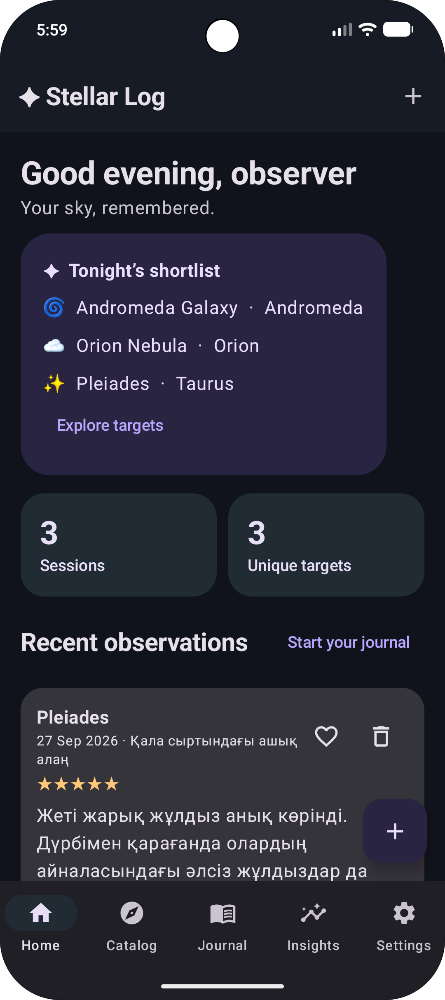
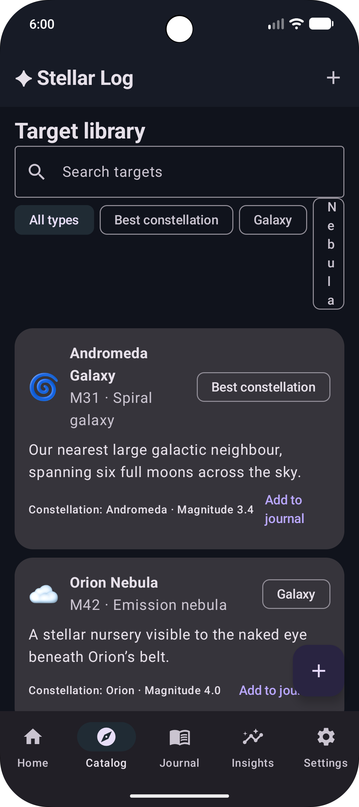
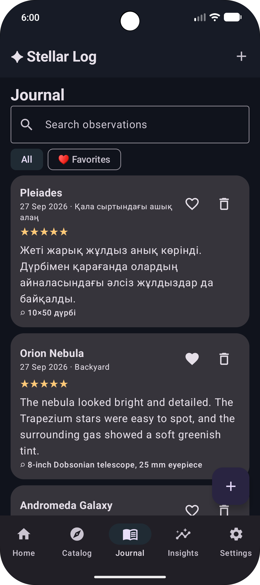
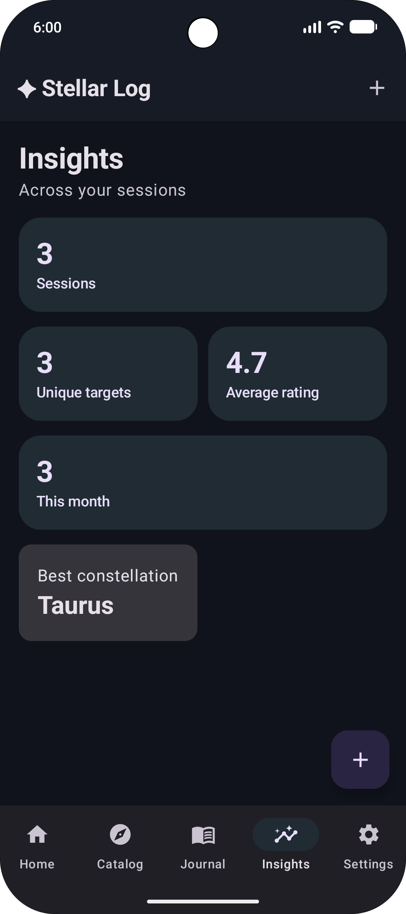
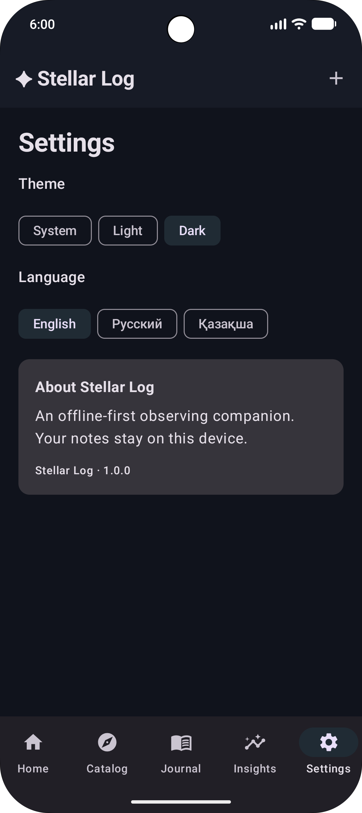

# ✦ Stellar Log

**An offline-first observing journal for curious skywatchers.** Pick a target, take it outside, and keep a record of what you saw.

## Screenshots

<table>
  <tr>
    <td align="center"><strong>Home</strong><br></td>
    <td align="center"><strong>Sky catalog</strong><br></td>
  </tr>
  <tr>
    <td align="center"><strong>Observation journal</strong><br></td>
    <td align="center"><strong>Insights</strong><br></td>
  </tr>
  <tr>
    <td align="center"><strong>Settings</strong><br></td>
    <td></td>
  </tr>
</table>
## Features

- Curated starter catalog: galaxies, nebulae, clusters, stars, and planets.
- Search objects and constellations; filter by object type.
- Log a session with location, equipment, 1–5 rating, and personal notes.
- Search observations, favorite entries, and delete records.
- Insights for session count, unique objects, average rating, and recent observing.
- System/light/dark theme and English, Russian, or Kazakh UI.
- Offline-first storage: Room database and Preferences DataStore; no account, tracking SDK, or network permission.

## Architecture

MVVM with Jetpack Compose + Material 3 UI, Navigation Compose destinations (Home, Catalog, Journal, Insights, Settings), lifecycle-aware ViewModel state, a repository boundary, Room DAO/database/entity, and a DataStore preferences repository. A small domain catalog provides curated celestial targets.

## Open in Android Studio

1. Extract the archive and open the `StellarLog` folder.
2. Use JDK 17; install Android SDK Platform 36 if prompted.
3. Let Android Studio sync Gradle, then run the `app` configuration on API 26 or newer.

The project includes the Gradle wrapper scripts. Android Studio can use them automatically; install JDK 17 and Android SDK Platform 36 when prompted.

## Structure

```text
app/src/main/java/com/stellarlog/app/
  data/       Room, repository, preferences
  domain/     Celestial catalog
  ui/         ViewModel and factory
  ui/theme/   Material 3 palette
  MainActivity.kt
gradle/libs.versions.toml
```

## Stack

Kotlin 2.2 · Jetpack Compose · Material 3 · MVVM · Navigation Compose · Room · DataStore · KSP · Gradle Kotlin DSL.

## Next steps

Ideas for expansion: seasonal observing plans, custom targets, equipment profiles, import/export, and a proper sky map. This starter does not claim to calculate live visibility or weather.

## License

MIT. See [LICENSE](LICENSE).